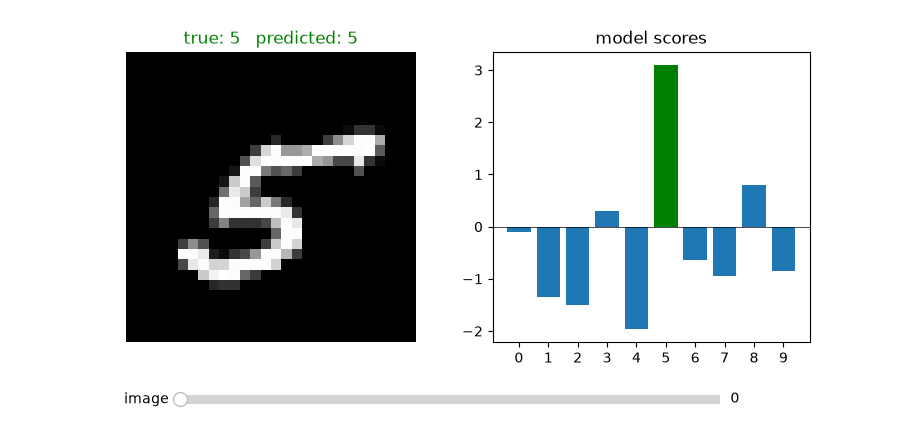

# zig-micrograd

A Zig 0.16.0 port of Andrej Karpathy's [micrograd](https://github.com/karpathy/micrograd/), a tiny scalar-valued autograd engine.

## Python side

This was tested with `cpython==3.14.8`, `uv==0.12.22` and `ziglang==0.16.0`.

- `make lock`: lock dependencies
- `make build`: build CPython extension for your platform using `ziglang==0.16.0`
- `make install-wheel`: install `zig_micrograd` wheel from `make build`
- `make install`: install all dependencies
- `make test`: run tests
- `make style`: format and lint

The original micrograd project is licensed under the MIT License.

## Zig side

```shell
python -m ziglang build run --summary all  # to test the code in main.zig
python -m ziglang build test --summary all  # to run the unit tests in root.zig
```

## Test on MNIST digits

Train a small MLP on MNIST digits with the command `make train-MNIST` as a sanity check.

At the end of training, there is a small visualization of each prediction.



## License and attribution

This project contains code derived from Andrej Karpathy's [micrograd](https://github.com/karpathy/micrograd/), which is licensed under the MIT License.
